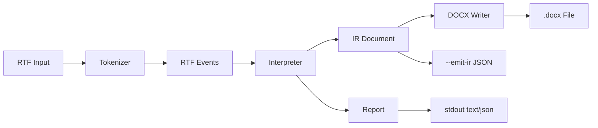

# rtfkit Architecture

This document reflects the current implementation in `main` (v0.6, Phase 6).

## Overview

`rtfkit` provides a complete RTF-to-DOCX conversion pipeline with an intermediate representation (IR), conversion reporting, and comprehensive test coverage.



## Workspace

```text
rtfkit/
├── crates/
│   ├── rtfkit-core/   # Parser, interpreter, IR, reporting, limits
│   ├── rtfkit-docx/   # DOCX writer implementation
│   └── rtfkit-cli/    # CLI entrypoint, tests, IO/report rendering
├── fixtures/          # RTF inputs for tests (44 fixtures organized by category)
├── golden/            # Golden IR snapshots
└── docs/
    ├── adr/           # Architecture Decision Records
    ├── arch/          # Architecture documentation
    └── specs/         # Phase specifications
```

## `rtfkit-core`

Responsibilities:
- Tokenization and event conversion
- Stateful interpretation with group stack/style stack
- IR construction (`Document -> Block -> Run`)
- Warning/stats reporting
- Structural RTF validation (header + balanced groups)
- Parser limits enforcement (input size, depth, warnings, table limits)

Not in scope:
- File IO
- CLI argument handling
- DOCX writing

### IR Model

The Intermediate Representation (IR) is the core data model for RTF documents:

```
Document
└── blocks: Vec<Block>
    ├── Paragraph { alignment, runs: Vec<Run> }
    ├── ListBlock { list_id, kind, items: Vec<ListItem> }
    └── TableBlock { rows: Vec<TableRow> }
        └── TableRow { cells: Vec<TableCell>, row_props }
            └── TableCell { blocks, width_twips, merge, v_align }
```

**Core Types:**
- `Document { blocks: Vec<Block> }` - Root document container
- `Block` - Block-level element (Paragraph, ListBlock, TableBlock)
- `Paragraph { alignment, runs }` - Text paragraph
- `Run { text, bold, italic, underline, font_size?, color? }` - Text run with formatting

**List Types (Phase 3):**
- `ListBlock { list_id, kind, items }` - List container
- `ListKind` - Bullet, OrderedDecimal, or Mixed
- `ListItem { level, blocks }` - Item with nesting level (0-8)

**Table Types (Phase 4-5):**
- `TableBlock { rows, table_props }` - Table container
- `TableRow { cells, row_props }` - Table row
- `TableCell { blocks, width_twips, merge, v_align }` - Table cell
- `CellMerge` - None, HorizontalStart, HorizontalContinue, VerticalStart, VerticalContinue
- `CellVerticalAlign` - Top, Center, Bottom
- `RowAlignment` - Left, Center, Right
- `RowProps` - Row-level formatting properties
- `TableProps` - Table-level properties (placeholder)

See [Phase 3 IR Design](phase3-ir-design.md) for list model details.
See [Phase 4 IR Design](phase4-ir-design.md) for table model details.
See [Phase 5 IR Design](phase5-ir-design.md) for merge semantics details.

### Parser/Interpreter Notes

**Text Formatting:**
- `\b`, `\i`, `\ul`, `\ulnone` - Bold, italic, underline toggles
- `\ql`, `\qc`, `\qr`, `\qj` - Paragraph alignment
- `\uN`, `\ucN` - Unicode escape handling

**List Controls (Phase 3):**
- `\lsN` - List reference
- `\ilvlN` - Nesting level
- `\listtable`, `\listoverridetable` - List definitions

**Table Controls (Phase 4-5):**
- `\trowd`, `\cellxN`, `\intbl`, `\cell`, `\row` - Table structure
- `\clmgf`, `\clmrg` - Horizontal merge
- `\clvmgf`, `\clvmrg` - Vertical merge
- `\clvertalt`, `\clvertalc`, `\clvertalb` - Cell vertical alignment
- `\trql`, `\trqc`, `\trqr`, `\trleft` - Row alignment and indent

**Destination Handling:**
- `fonttbl`, `colortbl` - Skipped (formatting not fully mapped)
- `\listtable`, `\listoverridetable` - Parsed for list definitions
- Unknown `\*` destinations - Skipped with `DroppedContent` warning
- Legacy `\pn...` controls - Dropped with warnings

**Escaped Symbols:**
- `\\`, `\{`, `\}` - Preserved as text

### Parser Limits

For safety and resource management (see [Limits Policy](../limits-policy.md)):

| Limit | Default | Error Type |
|-------|---------|------------|
| `max_input_bytes` | 10 MB | `ParseError::InputTooLarge` |
| `max_group_depth` | 256 levels | `ParseError::GroupDepthExceeded` |
| `max_warning_count` | 1000 | Warning cap (continues) |
| `max_rows_per_table` | 10,000 | `ParseError` (table structure) |
| `max_cells_per_row` | 1,000 | `ParseError` (table structure) |
| `max_merge_span` | 1,000 | `ParseError` (table structure) |

## `rtfkit-docx`

Responsibilities:
- Convert IR `Document` to DOCX format
- Map IR styles to OpenXML elements
- Write valid `.docx` ZIP archives

### IR → DOCX Mapping

| IR Element | DOCX Element |
|------------|--------------|
| `Document` | `<w:document>` |
| `Block::Paragraph` | `<w:p>` |
| `Block::ListBlock` | `<w:p>` with `<w:numPr>` |
| `Block::TableBlock` | `<w:tbl>` with `<w:tr>` and `<w:tc>` |
| `Run` | `<w:r>` |
| `Run.text` | `<w:t>` |
| `Run.bold = true` | `<w:b/>` in `<w:rPr>` |
| `Run.italic = true` | `<w:i/>` in `<w:rPr>` |
| `Run.underline = true` | `<w:u w:val="single"/>` |
| `Paragraph.alignment` | `<w:jc w:val="..."/>` |
| `ListBlock` | `numbering.xml` with `<w:abstractNum>` and `<w:num>` |
| `TableBlock` | `<w:tbl>` with grid columns |
| `CellMerge::HorizontalStart` | `<w:gridSpan w:val="N"/>` |
| `CellMerge::VerticalStart` | `<w:vMerge w:val="restart"/>` |
| `CellMerge::VerticalContinue` | `<w:vMerge w:val="continue"/>` |
| `CellVerticalAlign` | `<w:vAlign w:val="..."/>` |

## `rtfkit` CLI

Binary name: `rtfkit`

Command:

```bash
rtfkit convert [OPTIONS] <INPUT>
```

Options:
- `--format <text|json>`: report output format (default `text`)
- `--emit-ir <FILE>`: write IR as pretty JSON
- `--strict`: exit non-zero if `DroppedContent` warnings exist
- `-o, --output <FILE>`: write DOCX output to file
- `--force`: overwrite existing output file
- `--verbose`: debug logging

Exit codes:
- `0`: success
- `2`: parse/validation failure (invalid RTF or limit violation)
- `3`: writer/IO failure (cannot write output file)
- `4`: strict-mode violation

## Reporting

### Warning Types

| Type | Severity | Strict Mode | Description |
|------|----------|-------------|-------------|
| `UnsupportedControlWord` | Warning | No failure | Control word not implemented |
| `UnknownDestination` | Info | No failure | RTF destination skipped |
| `DroppedContent` | Warning | **Fails** | Content could not be represented |
| `UnsupportedListControl` | Warning | No failure | List control not fully supported |
| `UnresolvedListOverride` | Warning | **Fails** | List reference not found |
| `UnsupportedNestingLevel` | Info | No failure | List level clamped to 8 |
| `UnsupportedTableControl` | Warning | No failure | Table control not mapped |
| `MalformedTableStructure` | Warning | May fail | Table structure issue |
| `UnclosedTableCell` | Warning | May fail | Missing `\cell` terminator |
| `UnclosedTableRow` | Warning | May fail | Missing `\row` terminator |
| `MergeConflict` | Warning | **Fails** | Merge semantics conflict |
| `TableGeometryConflict` | Warning | **Fails** | Invalid table geometry |

See [Warning Reference](../warning-reference.md) for detailed documentation.

### Stats

- `paragraph_count` - Number of paragraphs processed
- `run_count` - Number of text runs processed
- `bytes_processed` - Total bytes read from input
- `duration_ms` - Processing duration in milliseconds

### Strict Mode

Strict mode checks for `DroppedContent` warnings and fails with exit code 4 if any are present. This ensures semantic fidelity in conversion.

**Warning Cap Behavior:** When the warning count limit is reached, `DroppedContent` warnings are specially preserved to ensure the strict-mode signal is not lost.

## Testing

### Test Layers

1. **Core unit tests** - Tokenizer/interpreter/report behavior
2. **DOCX writer unit tests** - XML generation
3. **Golden IR snapshot tests** - IR validation over all fixtures
4. **CLI contract tests** - Exit codes, strict mode, warning semantics (83 tests)
5. **Determinism tests** - IR/report/DOCX stability verification (35 tests)
6. **Limits tests** - Safety and resource protection (34 tests)
7. **DOCX integration tests** - End-to-end conversion validation

### Test Counts (Phase 6)

- Total tests: 300+
- Contract tests: 83
- Determinism tests: 35
- Limits tests: 34
- Golden fixtures: 44

### Golden Update Command

```bash
UPDATE_GOLDEN=1 cargo test -p rtfkit --test golden_tests
```

### Fixture Categories

Fixtures are organized by category:

- `text_*` - Text and formatting tests
- `list_*` - List structure tests
- `table_*` - Table structure tests
- `mixed_*` - Combined content tests
- `malformed_*` - Error recovery tests
- `limits_*` - Limit boundary tests

## Known Gaps

- Limited RTF feature coverage (no images as IR blocks)
- No hyperlinks/fields as first-class output
- DOCX output supports basic text formatting, lists, and tables
- Row alignment and indent not fully supported by docx-rs (cosmetic loss only)
- No full RTF spec compliance target

## References

- [ADR-0001: RTF Parser Selection](../adr/0001-rtf-parser-selection.md)
- [ADR-0002: DOCX Writer Selection](../adr/0002-docx-writer-selection.md)
- [Phase 1 Specification](../specs/PHASE1.md)
- [Phase 2 Specification](../specs/PHASE2.md)
- [Phase 3 Specification](../specs/PHASE3.md)
- [Phase 3 IR Design](phase3-ir-design.md)
- [Phase 4 Specification](../specs/PHASE4.md)
- [Phase 4 IR Design](phase4-ir-design.md)
- [Phase 5 Specification](../specs/PHASE5.md)
- [Phase 5 IR Design](phase5-ir-design.md)
- [Phase 6 Specification](../specs/PHASE6.md)
- [Initial Description](../specs/INITIAL_DESCRIPTION.md)
- [Limits Policy](../limits-policy.md)
- [Warning Reference](../warning-reference.md)
- [Feature Support Matrix](../feature-support.md)
