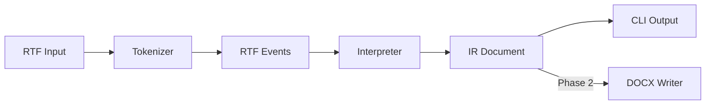
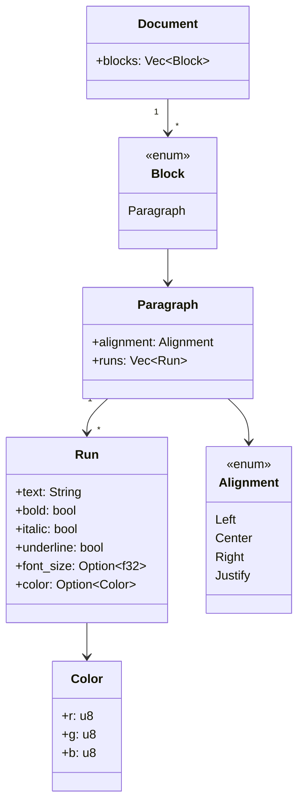
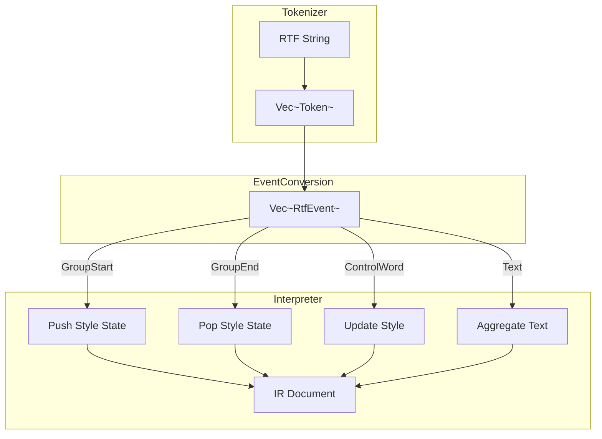
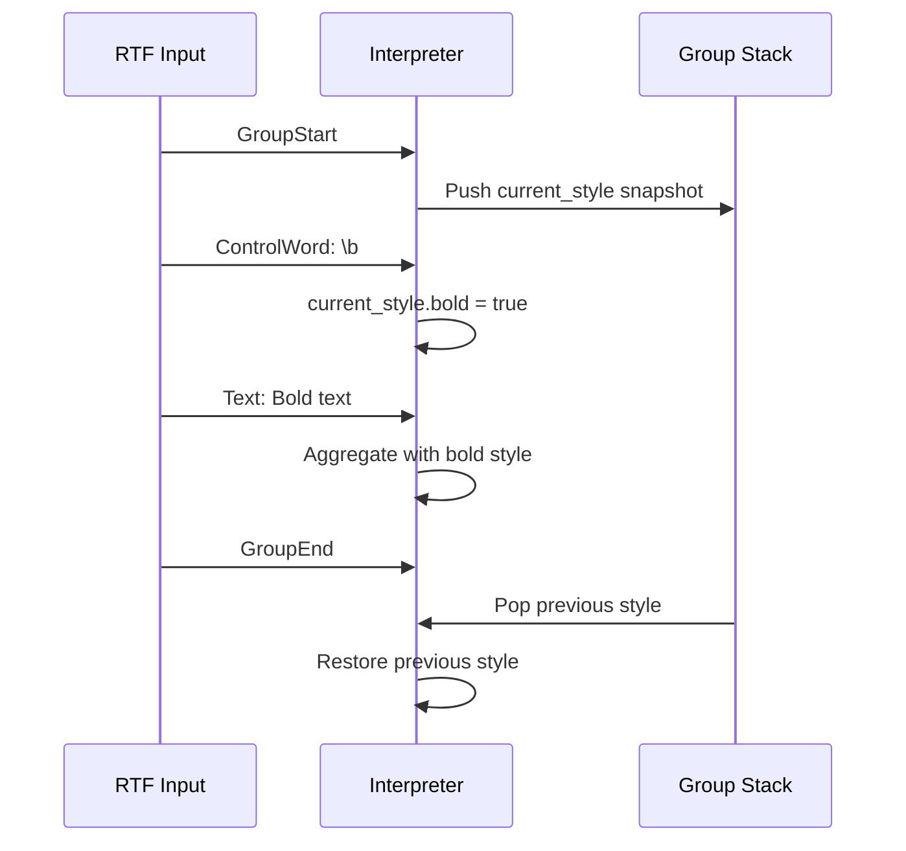
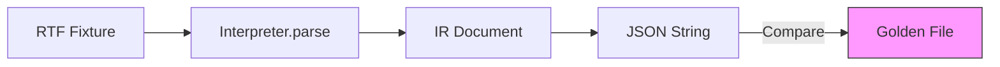
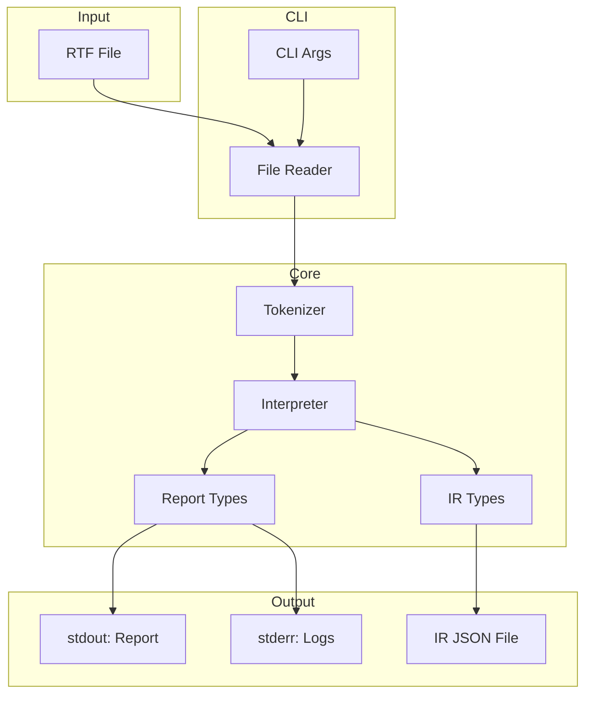

# rtfkit Architecture Documentation

This document provides a high-level overview of the `rtfkit` project architecture as of Phase 1 (v0.1).

## Overview

`rtfkit` is an open-source CLI tool for converting RTF (Rich Text Format) documents to other formats. The architecture follows a **pipeline pattern** with a clear separation between parsing, intermediate representation, and output generation.



## Workspace Structure

The project is organized as a Cargo workspace with two crates:

```
rtfkit/
├── crates/
│   ├── rtfkit-core/     # Core library
│   └── rtfkit-cli/      # CLI application
├── fixtures/            # RTF test fixtures
├── golden/              # Golden IR JSON files
└── docs/
    └── adr/             # Architecture Decision Records
```

### rtfkit-core

The core library is responsible for:

- **IR Types**: Defining the intermediate representation data structures
- **Parser/Tokenizer**: RTF lexical analysis using `nom` parser combinators
- **Interpreter**: Converting RTF events into the IR Document
- **Reporting**: Collecting warnings and statistics during conversion

**Key principle**: No CLI logic, no file I/O. The core library is purely focused on RTF processing.

### rtfkit-cli

The CLI application is responsible for:

- **Command-line interface**: Using `clap` for argument parsing
- **File I/O**: Reading RTF files, writing output files
- **Report rendering**: Formatting and displaying conversion reports
- **Exit code management**: Mapping results to appropriate exit codes
- **Strict mode enforcement**: Failing on dropped content warnings

---

## Intermediate Representation (IR)

The IR is the heart of the architecture. It provides a **format-agnostic, deterministic** representation of document content.

### Design Principles

1. **Format-agnostic**: The IR does not encode RTF-specific concepts. It represents semantic document structure.
2. **Deterministic**: Serialization is stable and reproducible. Same input always produces same output.
3. **Serializable**: All types implement `Serialize`/`Deserialize` for JSON output.
4. **Extensible**: The `Block` enum allows future expansion (tables, lists, images).

### Type Hierarchy



### Supported Features (v0.1)

| Feature | RTF Control Words | IR Representation |
|---------|-------------------|-------------------|
| Plain text | text content | `Run.text` |
| Bold | `\b`, `\b0` | `Run.bold` |
| Italic | `\i`, `\i0` | `Run.italic` |
| Underline | `\ul`, `\ulnone` | `Run.underline` |
| Paragraph break | `\par`, `\line` | New `Block::Paragraph` |
| Left align | `\ql` | `Alignment::Left` |
| Center align | `\qc` | `Alignment::Center` |
| Right align | `\qr` | `Alignment::Right` |
| Justify | `\qj` | `Alignment::Justify` |
| Unicode | `\uN` | Decoded in `Run.text` |
| Hex escapes | `\'hh` | Decoded via Windows-1252 |

---

## Parser/Interpreter Pipeline

The conversion from RTF to IR follows a **stateful interpreter pattern** as described in [ADR-0001](../adr/0001-rtf-parser-selection.md).

### Pipeline Stages



### Tokenizer

The tokenizer uses `nom` parser combinators to perform lexical analysis:

- **Input**: RTF string
- **Output**: `Vec<Token>`

**Token Types**:

| Token | RTF Syntax | Example |
|-------|------------|---------|
| `GroupStart` | `{` | `{` |
| `GroupEnd` | `}` | `}` |
| `ControlWord` | `\wordN` | `\b`, `\par`, `\u12345` |
| `Text` | plain text | `Hello World` |
| `ControlSymbol` | `\symbol` | `\'`, `\*` |

### Interpreter

The interpreter maintains state and builds the IR:

**State Components**:

| Component | Purpose |
|-----------|---------|
| `group_stack` | Stack of `StyleState` for RTF group scoping |
| `current_style` | Active formatting state |
| `current_text` | Text being aggregated for current run |
| `current_paragraph` | Paragraph being built |
| `report_builder` | Collecting warnings and stats |

**Group Stack Behavior**:



This pattern correctly handles RTF's scoping rules where formatting changes within a group are local to that group.

---

## Reporting Layer

The reporting layer provides visibility into the conversion process.

### Warning Types

| Warning | Severity | When Raised |
|---------|----------|-------------|
| `UnsupportedControlWord` | Warning | Unknown control word encountered |
| `UnknownDestination` | Info | RTF destination not recognized |
| `DroppedContent` | Warning | Content could not be represented |

### Statistics Collected

| Statistic | Description |
|-----------|-------------|
| `paragraph_count` | Number of paragraphs processed |
| `run_count` | Number of text runs processed |
| `bytes_processed` | Total bytes read from input |
| `duration_ms` | Processing duration in milliseconds |

### Strict Mode

When `--strict` flag is enabled:

1. Check for `DroppedContent` warnings
2. If any exist, exit with code 4
3. Print details of dropped content to stderr

This enables CI pipelines to detect when conversion quality may be compromised.

---

## CLI Interface

### Command Structure

```bash
rtfkit convert [OPTIONS] <INPUT>
```

### Options

| Option | Default | Description |
|--------|---------|-------------|
| `--to` | `docx` | Output format (Phase 2) |
| `--format` | `text` | Report format: `text` or `json` |
| `--emit-ir <FILE>` | - | Serialize IR to JSON file |
| `--strict` | false | Fail on dropped content |
| `--verbose` | false | Enable debug logging |

### Exit Codes

| Code | Meaning |
|------|---------|
| 0 | Success |
| 2 | Parse error / invalid RTF |
| 3 | Conversion error (writer/IO) |
| 4 | Strict mode violated |

### Output Behavior

- **stdout**: Conversion report only (no binary data)
- **stderr**: Errors, warnings, debug logs
- **files**: IR JSON (when `--emit-ir` used)

---

## Testing Strategy

### Golden Tests

The project uses **golden testing** to ensure parsing consistency:



**Process**:

1. Parse all RTF fixtures in `fixtures/`
2. Serialize resulting IR to JSON
3. Compare against golden files in `golden/`
4. Fail on any mismatch

**Updating Golden Files**:

```bash
UPDATE_GOLDEN=1 cargo test -p rtfkit-cli
```

### Fixture Organization

| Fixture | Purpose |
|---------|---------|
| `simple_paragraph.rtf` | Basic text content |
| `bold_italic.rtf` | Bold and italic formatting |
| `underline.rtf` | Underline formatting |
| `alignment.rtf` | Paragraph alignment |
| `unicode.rtf` | Unicode character handling |
| `multiple_paragraphs.rtf` | Multiple paragraph breaks |
| `nested_styles.rtf` | Nested group formatting |
| `mixed_formatting.rtf` | Combined formatting |
| `empty.rtf` | Empty document handling |
| `complex.rtf` | Comprehensive feature test |

### Test Categories

1. **Golden tests**: IR snapshot comparison
2. **Feature tests**: Specific RTF feature validation
3. **Unit tests**: Internal component testing (in source files)

---

## Data Flow Summary



---

## Future Expansion

The architecture is designed for future growth:

### Phase 2: DOCX Writer

- New crate or module: `rtfkit-docx`
- Consumes IR, produces `.docx`
- No changes to core parsing logic

### Phase 3: Additional Targets

- HTML writer: Same IR, HTML output
- PDF writer: Same IR, PDF output via rendering backend

### IR Extensions

The `Block` enum can be extended:

```rust
enum Block {
    Paragraph(Paragraph),
    // Future additions:
    // Table(Table),
    // List(List),
    // Image(Image),
}
```

---

## References

- [ADR-0001: RTF Parser Selection](../adr/0001-rtf-parser-selection.md)
- [Phase 1 Specification](../PHASE1.md)
- [RTF Specification v1.9.1](https://www.microsoft.com/en-us/download/details.aspx?id=10725)
