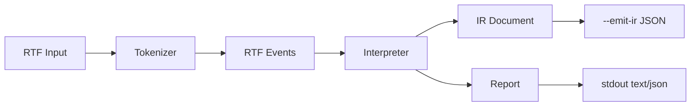

# rtfkit Architecture

This document reflects the current implementation in `main` (v0.1, Phase 1).

## Overview

`rtfkit` currently provides a parser/interpreter pipeline from RTF to an internal IR plus a conversion report.



## Workspace

```text
rtfkit/
├── crates/
│   ├── rtfkit-core/   # Parser, interpreter, IR, reporting
│   └── rtfkit-cli/    # CLI entrypoint and IO/report rendering
├── fixtures/          # RTF inputs for tests
├── golden/            # Golden IR snapshots
└── docs/
    ├── adr/
    └── specs/
```

## `rtfkit-core`

Responsibilities:
- Tokenization and event conversion
- Stateful interpretation with group stack/style stack
- IR construction (`Document -> Block::Paragraph -> Run`)
- Warning/stats reporting
- Structural RTF validation (header + balanced groups)

Not in scope:
- File IO
- CLI argument handling
- DOCX writing

### IR model

- `Document { blocks: Vec<Block> }`
- `Block::Paragraph(Paragraph)`
- `Paragraph { alignment, runs }`
- `Run { text, bold, italic, underline, font_size?, color? }`

### Parser/interpreter notes

- Control words handled for MVP: `\b`, `\i`, `\ul`, `\ulnone`, `\par`, `\line`, `\ql`, `\qc`, `\qr`, `\qj`, `\uN`, `\ucN`
- Destination groups are skipped at group start (e.g. `fonttbl`, `colortbl`, unknown `\*` destinations)
- Escaped symbols (`\\`, `\{`, `\}`) are preserved as text
- Unsupported destination content emits `DroppedContent` warnings

## `rtfkit` CLI

Binary name: `rtfkit`

Command:

```bash
rtfkit convert [OPTIONS] <INPUT>
```

Options:
- `--format <text|json>`: report output format (default `text`)
- `--emit-ir <FILE>`: write IR as pretty JSON
- `--strict`: exit non-zero if `DroppedContent` warnings exist
- `--to <docx>`: reserved target selector (currently only `docx` accepted)
- `-o, --output <FILE>`: reserved for future DOCX writer; rejected in v0.1
- `--verbose`: debug logging

Exit codes:
- `0`: success
- `2`: parse/validation error (invalid RTF)
- `3`: conversion/IO contract error (including unsupported `--output`)
- `4`: strict-mode violation

## Reporting

Warnings:
- `UnsupportedControlWord`
- `UnknownDestination`
- `DroppedContent`

Stats:
- `paragraph_count`
- `run_count`
- `bytes_processed`
- `duration_ms`

Strict mode checks `DroppedContent` warnings.

## Testing

Test layers:
- Core unit tests for tokenizer/interpreter/report behavior
- Golden IR snapshot tests over all fixtures
- CLI contract tests for exit codes/strict mode/invalid input

Golden update command:

```bash
UPDATE_GOLDEN=1 cargo test -p rtfkit --test golden_tests
```

## Known gaps

- No DOCX writer yet (Phase 2)
- Limited RTF feature coverage (no tables/lists/images as IR blocks)
- No full RTF spec compliance target for v0.1

## References

- [ADR-0001: RTF Parser Selection](../adr/0001-rtf-parser-selection.md)
- [Phase 1 Specification](../specs/PHASE1.md)
- [Initial Description](../specs/INITIAL_DESCRIPTION.md)
