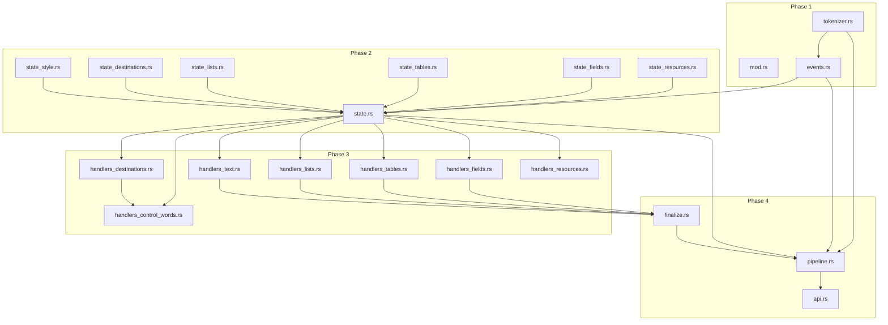

# Comprehensive Detailed Implementation Plan: RTF Interpreter Refactor

## Executive Summary

This document provides a detailed implementation plan for refactoring the monolithic `interpreter.rs` (5,297 LOC) into a modular architecture under `crates/rtfkit-core/src/rtf/`. The refactor maintains 100% behavioral compatibility while improving code organization, maintainability, and test isolation.

## Current State Analysis

### File Structure Analysis

**Current `interpreter.rs` composition (5,297 lines):**

| Section | Lines | Description |
|---------|-------|-------------|
| Token Types | 45-65 | `Token` enum definition |
| Events | 67-89 | `RtfEvent` enum definition |
| Style State | 91-141 | `StyleState` struct |
| List Parsing Types | 143-261 | `ParsedListLevel`, `ParsedListDefinition`, `ParsedListOverride`, `ParagraphListRef`, `DestinationBehavior`, `NestedFieldState` |
| Interpreter Struct | 263-455 | Main struct with ~80 fields |
| Interpreter Impl | 457-2809 | Core logic (~2,350 lines) |
| Tokenizer | 2811-3018 | nom-based tokenizer (~200 lines) |
| Tests | 3020-5297 | Unit tests (~2,277 lines) |

### Current Public API (from `lib.rs`)

```rust
pub use interpreter::{
    Interpreter, ParagraphListRef, ParsedListDefinition, 
    ParsedListLevel, ParsedListOverride, RtfEvent, StyleState, Token,
};
```

### Key Dependencies

The interpreter imports from:
- `crate::error` - `ConversionError`, `ParseError`
- `crate::limits` - `ParserLimits`
- `crate::report` - `ReportBuilder`, `Report`
- `crate::*` - IR types (`Document`, `Block`, `Paragraph`, `Run`, etc.)
- External: `nom`, `std::collections::HashMap`

---

## Target Architecture

### Module Tree

```
crates/rtfkit-core/src/rtf/
├── mod.rs                    # Module structure and re-exports
├── api.rs                    # Public entrypoints and RtfParser
├── pipeline.rs               # Parse flow orchestration
├── tokenizer.rs              # Token model and nom tokenizer
├── events.rs                 # Event model and token-to-event conversion
├── state.rs                  # RuntimeState top-level container
├── state_style.rs            # StyleState and run state management
├── state_destinations.rs     # Destination skip state
├── state_lists.rs            # List parse/resolve state
├── state_tables.rs           # Table/merge/shading state
├── state_fields.rs           # Field/hyperlink state
├── state_resources.rs        # Font/color table state
├── handlers_destinations.rs  # Destination detection and skip logic
├── handlers_control_words.rs # Control word dispatch
├── handlers_text.rs          # Text handling and run creation
├── handlers_lists.rs         # List control word handlers
├── handlers_tables.rs        # Table control word handlers
├── handlers_fields.rs        # Field/hyperlink handlers
├── handlers_resources.rs     # Font/color table handlers
├── finalize.rs               # Paragraph/cell/row/table finalization
└── tests/
    ├── mod.rs                # Test module structure
    ├── tokenizer.rs          # Tokenizer tests
    ├── limits.rs             # Limit enforcement tests
    ├── destinations.rs       # Destination handling tests
    ├── lists.rs              # List parsing tests
    ├── tables.rs             # Table parsing tests
    ├── fields.rs             # Field/hyperlink tests
    ├── font_color.rs         # Font/color table tests
    ├── shading.rs            # Shading tests
    └── regression.rs         # Regression/snapshot tests
```

---

## Detailed Module Specifications

### 1. `rtf/mod.rs` (~50 LOC)

**Purpose:** Module organization and public re-exports

**Public API:**
```rust
// Public entrypoints only
pub use api::{parse, parse_with_limits, RtfParser};

// Re-export types needed by consumers (but not internal types)
pub use crate::{Document, Report, ConversionError, ParserLimits};
```

**Dependencies:** All internal modules (for re-exports)

**Contents:**
- Module declarations
- Public re-exports
- Documentation for the `rtf` module

---

### 2. `rtf/api.rs` (~150 LOC)

**Purpose:** Public API entrypoints

**Public API:**
```rust
/// Parse RTF input with default limits
pub fn parse(input: &str) -> Result<(Document, Report), ConversionError>;

/// Parse RTF input with custom limits
pub fn parse_with_limits(
    input: &str, 
    limits: ParserLimits
) -> Result<(Document, Report), ConversionError>;

/// Stateful RTF parser with configurable limits
pub struct RtfParser {
    limits: ParserLimits,
}

impl RtfParser {
    pub fn new() -> Self;
    pub fn with_limits(limits: ParserLimits) -> Self;
    pub fn parse(&self, input: &str) -> Result<(Document, Report), ConversionError>;
}
```

**Dependencies:**
- `pipeline.rs` (for orchestration)
- `state.rs` (for RuntimeState)
- `crate::error`, `crate::limits`, `crate::report`

**Code from `interpreter.rs`:**
- `Interpreter::parse()` (lines 564-566)
- `Interpreter::parse_with_limits()` (lines 587-630)
- Constructor logic from `Interpreter::new()` and `Interpreter::with_limits()` (lines 459-549)

---

### 3. `rtf/pipeline.rs` (~200 LOC)

**Purpose:** Parse flow orchestration

**Public API:**
```rust
/// Execute the full parse pipeline
pub fn run_parse_pipeline(
    input: &str,
    limits: ParserLimits,
) -> Result<(Document, Report), ConversionError>;

/// Internal: Process tokens through the interpreter
fn process_tokens(
    state: &mut RuntimeState,
    tokens: Vec<Token>,
) -> Result<(), ConversionError>;
```

**Dependencies:**
- `tokenizer.rs` (for tokenize)
- `events.rs` (for token_to_event, validate_tokens)
- `state.rs` (for RuntimeState)
- `finalize.rs` (for finalization)

**Code from `interpreter.rs`:**
- Token processing loop (lines 609-612)
- Finalization calls (lines 615-624)
- Report building (lines 627)

---

### 4. `rtf/tokenizer.rs` (~250 LOC)

**Purpose:** Token model and nom-based tokenization

**Public API:**
```rust
/// Token representing a parsed RTF element
#[derive(Debug, Clone, PartialEq)]
pub enum Token {
    GroupStart,
    GroupEnd,
    ControlWord { word: String, parameter: Option<i32> },
    Text(String),
    ControlSymbol(char),
}

/// Tokenize RTF input into tokens
pub fn tokenize(input: &str) -> Result<Vec<Token>, nom::Err<nom::error::Error<&str>>>;

/// Validate token sequence for structural correctness
pub fn validate_tokens(tokens: &[Token]) -> Result<(), ParseError>;
```

**Internal Functions:**
```rust
fn parse_token(input: &str) -> IResult<&str, Token>;
fn parse_text(input: &str) -> IResult<&str, String>;
fn decode_text(text: &str) -> String;
fn decode_windows1252(codepoint: u8) -> char;
fn skip_ignorable_whitespace(input: &str) -> &str;
```

**Dependencies:**
- `nom` crate
- `crate::error::ParseError`

**Code from `interpreter.rs`:**
- `Token` enum (lines 50-65)
- `tokenize()` (lines 2816-2839)
- `validate_tokens()` (lines 2841-2871)
- `decode_windows1252()` (lines 2875-2909)
- `parse_token()` (lines 2912-2972)
- `parse_text()` (lines 2975-2983)
- `decode_text()` (lines 2986-2994)
- `skip_ignorable_whitespace()` (lines 2997-3007)

---

### 5. `rtf/events.rs` (~100 LOC)

**Purpose:** Event model and conversion

**Public API:**
```rust
/// Events emitted during RTF parsing
#[derive(Debug, Clone, PartialEq)]
pub enum RtfEvent {
    GroupStart,
    GroupEnd,
    ControlWord { word: String, parameter: Option<i32> },
    ControlSymbol(char),
    Text(String),
    BinaryData(Vec<u8>),
}

/// Convert a token to an event
pub fn token_to_event(token: Token) -> RtfEvent;
```

**Dependencies:**
- `tokenizer::Token`

**Code from `interpreter.rs`:**
- `RtfEvent` enum (lines 72-89)
- `token_to_event()` (lines 3010-3018)

---

### 6. `rtf/state.rs` (~300 LOC)

**Purpose:** Top-level runtime state container

**Public API:**
```rust
/// Top-level runtime state for RTF parsing
pub struct RuntimeState {
    // Sub-states
    pub style: StyleState,
    pub destinations: DestinationState,
    pub lists: ListState,
    pub tables: TableState,
    pub fields: FieldState,
    pub resources: ResourceState,
    
    // Core parsing state
    pub group_stack: Vec<StyleState>,
    pub group_can_start_destination: Vec<bool>,
    pub current_depth: usize,
    pub limits: ParserLimits,
    
    // Document building
    pub document: Document,
    pub current_paragraph: Paragraph,
    pub current_text: String,
    pub current_run_style: StyleState,
    pub paragraph_alignment: Alignment,
    
    // Unicode handling
    pub unicode_skip_count: usize,
    pub skip_next_chars: usize,
    
    // Report building
    pub report_builder: ReportBuilder,
    
    // Error tracking
    pub hard_failure: Option<ParseError>,
}

impl RuntimeState {
    pub fn new(limits: ParserLimits) -> Self;
    pub fn set_hard_failure(&mut self, err: ParseError);
}
```

**Dependencies:**
- All state modules
- `crate::limits::ParserLimits`
- `crate::report::ReportBuilder`
- IR types

**Code from `interpreter.rs`:**
- Interpreter struct fields (lines 277-455)
- `set_hard_failure()` (lines 940-944)

---

### 7. `rtf/state_style.rs` (~150 LOC)

**Purpose:** Style state and run management

**Public API:**
```rust
/// Character and paragraph style state
#[derive(Debug, Clone, Default, PartialEq)]
pub struct StyleState {
    // Character formatting
    pub bold: bool,
    pub italic: bool,
    pub underline: bool,
    pub font_index: Option<i32>,
    pub font_size_half_points: Option<i32>,
    pub color_index: Option<i32>,
    pub highlight_color_index: Option<i32>,
    pub background_color_index: Option<i32>,
    
    // Paragraph formatting
    pub alignment: Alignment,
    
    // Paragraph shading (reset by \pard, NOT by \plain)
    pub paragraph_cbpat: Option<i32>,
    pub paragraph_cfpat: Option<i32>,
    pub paragraph_shading: Option<i32>,
}

impl StyleState {
    pub fn new() -> Self;
    pub fn snapshot(&self) -> Self;
}

/// Check if character style differs between two states
pub fn character_style_changed(current: &StyleState, run: &StyleState) -> bool;

/// Reset character formatting (for \plain)
pub fn reset_character_formatting(style: &mut StyleState, default_font: Option<i32>);
```

**Dependencies:**
- `crate::Alignment`

**Code from `interpreter.rs`:**
- `StyleState` struct (lines 100-128)
- `StyleState::new()`, `StyleState::snapshot()` (lines 130-141)
- `reset_character_formatting()` (lines 947-967)
- `character_style_changed()` logic (lines 1637-1650)

---

### 8. `rtf/state_destinations.rs` (~80 LOC)

**Purpose:** Destination skip state tracking

**Public API:**
```rust
/// Destination parsing state
#[derive(Debug, Clone, Default)]
pub struct DestinationState {
    pub destination_marker: bool,
    pub skip_destination_depth: usize,
}
```

**Dependencies:** None

**Code from `interpreter.rs`:**
- `destination_marker` field (line 299)
- `skip_destination_depth` field (line 301)

---

### 9. `rtf/state_lists.rs` (~200 LOC)

**Purpose:** List parsing and resolution state

**Public API:**
```rust
/// Parsed list level from \listtable
#[derive(Debug, Clone, PartialEq)]
pub struct ParsedListLevel {
    pub level: u8,
    pub kind: ListKind,
}

/// Parsed list definition from \listtable
#[derive(Debug, Clone, PartialEq)]
pub struct ParsedListDefinition {
    pub list_id: i32,
    pub levels: Vec<ParsedListLevel>,
}

impl ParsedListDefinition {
    pub fn new(list_id: i32) -> Self;
    pub fn kind_for_level(&self, level: u8) -> ListKind;
}

/// Parsed list override from \listoverridetable
#[derive(Debug, Clone, PartialEq)]
pub struct ParsedListOverride {
    pub ls_id: i32,
    pub list_id: i32,
    pub start_override: Option<i32>,
}

impl ParsedListOverride {
    pub fn new(ls_id: i32, list_id: i32) -> Self;
}

/// Resolved list reference for current paragraph
#[derive(Debug, Clone, PartialEq)]
pub struct ParagraphListRef {
    pub list_id: ListId,
    pub level: u8,
    pub kind: ListKind,
}

impl ParagraphListRef {
    pub fn new(list_id: ListId, level: u8, kind: ListKind) -> Self;
}

/// List parsing state
#[derive(Debug, Clone, Default)]
pub struct ListState {
    // Resolved list data
    pub list_table: HashMap<i32, ParsedListDefinition>,
    pub list_overrides: HashMap<i32, ParsedListOverride>,
    
    // Current paragraph list state
    pub current_list_ref: Option<ParagraphListRef>,
    pub pending_ls_id: Option<i32>,
    pub pending_level: u8,
    
    // List table parsing state
    pub parsing_list_table: bool,
    pub parsing_list_override_table: bool,
    pub current_list_def: Option<ParsedListDefinition>,
    pub current_list_level: Option<ParsedListLevel>,
    pub current_list_override: Option<ParsedListOverride>,
}
```

**Dependencies:**
- `crate::{ListId, ListKind}`

**Code from `interpreter.rs`:**
- List types (lines 148-236)
- List state fields (lines 320-342)

---

### 10. `rtf/state_tables.rs` (~250 LOC)

**Purpose:** Table, merge, and shading state

**Public API:**
```rust
/// Table parsing state
#[derive(Debug, Clone, Default)]
pub struct TableState {
    // Current table structure
    pub current_table: Option<TableBlock>,
    pub current_row: Option<TableRow>,
    pub current_cell: Option<TableCell>,
    
    // Cell boundaries and properties
    pub pending_cellx: Vec<i32>,
    pub pending_cell_merges: Vec<Option<CellMerge>>,
    pub pending_cell_v_aligns: Vec<Option<CellVerticalAlign>>,
    pub pending_cell_cbpats: Vec<Option<i32>>,
    pub pending_cell_cfpats: Vec<Option<i32>>,
    pub pending_cell_shadings: Vec<Option<i32>>,
    
    // Current cell properties
    pub pending_cell_merge: Option<CellMerge>,
    pub pending_cell_v_align: Option<CellVerticalAlign>,
    pub pending_cell_cbpat: Option<i32>,
    pub pending_cell_cfpat: Option<i32>,
    pub pending_cell_shading: Option<i32>,
    
    // Row properties
    pub pending_row_props: RowProps,
    pub pending_row_cbpat: Option<i32>,
    pub pending_row_cfpat: Option<i32>,
    pub pending_row_shading: Option<i32>,
    
    // Table properties
    pub pending_table_cbpat: Option<i32>,
    pub pending_table_cfpat: Option<i32>,
    pub pending_table_shading: Option<i32>,
    
    // Flags
    pub seen_intbl_in_paragraph: bool,
}
```

**Dependencies:**
- `crate::{TableBlock, TableRow, TableCell, CellMerge, CellVerticalAlign, RowProps}`

**Code from `interpreter.rs`:**
- Table state fields (lines 374-426)

---

### 11. `rtf/state_fields.rs` (~150 LOC)

**Purpose:** Field and hyperlink state

**Public API:**
```rust
/// Nested field tracking state
#[derive(Debug, Clone, Default)]
pub struct NestedFieldState {
    pub field_group_depth: usize,
    pub parsing_fldinst: bool,
    pub fldinst_group_depth: usize,
    pub parsing_fldrslt: bool,
    pub fldrslt_group_depth: usize,
}

/// Field parsing state
#[derive(Debug, Clone, Default)]
pub struct FieldState {
    // Field parsing flags
    pub parsing_field: bool,
    pub field_group_depth: usize,
    pub parsing_fldinst: bool,
    pub fldinst_group_depth: usize,
    pub parsing_fldrslt: bool,
    pub fldrslt_group_depth: usize,
    
    // Field content
    pub field_instruction_text: String,
    pub field_result_inlines: Vec<Inline>,
    pub field_style_snapshot: Option<StyleState>,
    
    // Nested fields
    pub nested_fields: Vec<NestedFieldState>,
}
```

**Dependencies:**
- `crate::Inline`
- `state_style::StyleState`

**Code from `interpreter.rs`:**
- `NestedFieldState` (lines 254-261)
- Field state fields (lines 433-454)

---

### 12. `rtf/state_resources.rs` (~150 LOC)

**Purpose:** Font and color table state

**Public API:**
```rust
/// Resource table state
#[derive(Debug, Clone, Default)]
pub struct ResourceState {
    // Font table
    pub default_font_index: Option<i32>,
    pub font_table: HashMap<i32, String>,
    pub parsing_font_table: bool,
    pub current_font_index: Option<i32>,
    pub current_font_name: String,
    
    // Color table
    pub color_table: Vec<ColorEntry>,
    pub parsing_color_table: bool,
    pub current_red: u8,
    pub current_green: u8,
    pub current_blue: u8,
    pub color_components_seen: bool,
    pub current_theme_color: Option<ThemeColor>,
    pub current_theme_tint: Option<u8>,
    pub current_theme_shade: Option<u8>,
}
```

**Dependencies:**
- `crate::{ColorEntry, ThemeColor}`

**Code from `interpreter.rs`:**
- Resource state fields (lines 310-370)

---

### 13. `rtf/handlers_destinations.rs` (~300 LOC)

**Purpose:** Destination detection and skip logic

**Public API:**
```rust
/// Destination behavior classification
#[derive(Debug, Clone, Copy, PartialEq, Eq)]
pub enum DestinationBehavior {
    Metadata,
    Dropped(&'static str),
    ListTable,
    ListOverrideTable,
    FldInst,
    FldRslt,
    FontTable,
    ColorTable,
}

/// Get destination behavior for a word
pub fn destination_behavior(word: &str) -> Option<DestinationBehavior>;

/// Check if current position can start a destination
pub fn can_start_destination(state: &RuntimeState) -> bool;

/// Mark current group as non-destination
pub fn mark_current_group_non_destination(state: &mut RuntimeState);

/// Attempt to start a destination, returns true if handled
pub fn maybe_start_destination(state: &mut RuntimeState, word: &str) -> bool;

/// Process event while skipping destination
pub fn process_skipped_destination_event(
    state: &mut RuntimeState,
    event: RtfEvent,
) -> Result<(), ConversionError>;
```

**Dependencies:**
- `state.rs`, `state_destinations.rs`, `state_lists.rs`, `state_resources.rs`
- `events::RtfEvent`
- `crate::error::ConversionError`

**Code from `interpreter.rs`:**
- `DestinationBehavior` enum (lines 238-252)
- `can_start_destination()` (lines 1104-1109)
- `mark_current_group_non_destination()` (lines 1111-1115)
- `destination_behavior()` (lines 1117-1145)
- `maybe_start_destination()` (lines 1147-1237)
- `process_skipped_destination_event()` (lines 696-859)

---

### 14. `rtf/handlers_control_words.rs` (~400 LOC)

**Purpose:** Main control word dispatch

**Public API:**
```rust
/// Handle a control word event
pub fn handle_control_word(
    state: &mut RuntimeState,
    word: &str,
    parameter: Option<i32>,
);

/// Handle a control symbol event
pub fn handle_control_symbol(state: &mut RuntimeState, symbol: char);
```

**Internal Functions:**
```rust
fn handle_character_formatting(state: &mut RuntimeState, word: &str, parameter: Option<i32>);
fn handle_paragraph_controls(state: &mut RuntimeState, word: &str, parameter: Option<i32>);
fn handle_alignment(state: &mut RuntimeState, word: &str);
fn handle_unicode(state: &mut RuntimeState, parameter: Option<i32>);
fn handle_shading_controls(state: &mut RuntimeState, word: &str, parameter: Option<i32>);
fn handle_header_controls(state: &mut RuntimeState, word: &str, parameter: Option<i32>);
```

**Dependencies:**
- All state modules
- All handler modules
- `events::RtfEvent`

**Code from `interpreter.rs`:**
- `handle_control_word()` (lines 1239-1578)
- `handle_control_symbol()` (lines 1068-1102)

---

### 15. `rtf/handlers_text.rs` (~250 LOC)

**Purpose:** Text handling and run creation

**Public API:**
```rust
/// Handle text content
pub fn handle_text(state: &mut RuntimeState, text: String);

/// Handle text within field result
pub fn handle_field_result_text(state: &mut RuntimeState, text: String);

/// Flush current text as a run
pub fn flush_current_text_as_run(state: &mut RuntimeState);

/// Create a run from current state
pub fn create_run(state: &RuntimeState) -> Run;
```

**Internal Functions:**
```rust
fn handle_text_internal(state: &mut RuntimeState, text: String);
fn handle_text_with_skip(state: &mut RuntimeState, text: String);
fn resolve_font_family(state: &RuntimeState) -> Option<String>;
fn resolve_font_size(state: &RuntimeState) -> Option<f32>;
fn resolve_color(state: &RuntimeState) -> Option<Color>;
fn resolve_background_color(state: &RuntimeState) -> Option<Color>;
fn resolve_color_from_index(state: &RuntimeState, color_idx: i32) -> Option<Color>;
```

**Dependencies:**
- `state.rs`, `state_style.rs`, `state_resources.rs`
- `crate::{Run, Color}`

**Code from `interpreter.rs`:**
- `handle_text()` (lines 1581-1598)
- `handle_text_internal()` (lines 1601-1630)
- `style_changed()`, `character_style_changed()` (lines 1633-1650)
- `create_run()` (lines 1653-1676)
- `resolve_font_size()` (lines 1679-1685)
- `resolve_font_family()` (lines 1688-1706)
- `resolve_color()` (lines 1709-1727)
- `resolve_background_color()` (lines 1730-1750)
- `resolve_color_from_index()` (lines 1753-1768)
- `flush_current_text_as_run()` (lines 1842-1848)

---

### 16. `rtf/handlers_lists.rs` (~200 LOC)

**Purpose:** List control word handlers

**Public API:**
```rust
/// Handle list control word (\ls, \ilvl)
pub fn handle_list_control_word(
    state: &mut RuntimeState,
    word: &str,
    parameter: Option<i32>,
);

/// Handle list table control word
pub fn handle_list_table_control_word(
    state: &mut RuntimeState,
    word: &str,
    parameter: Option<i32>,
);

/// Resolve list reference from pending state
pub fn resolve_list_reference(state: &mut RuntimeState);

/// Add list item to document or cell
pub fn add_list_item(
    state: &mut RuntimeState,
    list_id: ListId,
    level: u8,
    kind: ListKind,
    paragraph: Paragraph,
);

/// Add list item to current table cell
pub fn add_list_item_to_current_cell(
    state: &mut RuntimeState,
    list_id: ListId,
    level: u8,
    kind: ListKind,
    paragraph: Paragraph,
);
```

**Dependencies:**
- `state.rs`, `state_lists.rs`
- `crate::{ListId, ListKind, Paragraph}`

**Code from `interpreter.rs`:**
- List control word handling in `handle_control_word()` (lines 1322-1346)
- `handle_list_table_control_word()` (lines 970-1066)
- `resolve_list_reference()` (lines 1928-1956)
- `add_list_item()` (lines 1959-1973)
- `add_list_item_to_current_cell()` (lines 1975-1999)

---

### 17. `rtf/handlers_tables.rs` (~350 LOC)

**Purpose:** Table control word handlers

**Public API:**
```rust
/// Handle \trowd - start of row definition
pub fn handle_trowd(state: &mut RuntimeState);

/// Handle \cellx - cell boundary
pub fn handle_cellx(state: &mut RuntimeState, boundary: i32);

/// Handle \intbl - paragraph in table
pub fn handle_intbl(state: &mut RuntimeState);

/// Handle \cell - end of cell
pub fn handle_cell(state: &mut RuntimeState);

/// Handle \row - end of row
pub fn handle_row(state: &mut RuntimeState);

/// Handle cell merge controls
pub fn handle_cell_merge_control(
    state: &mut RuntimeState,
    word: &str,
);

/// Handle cell vertical alignment controls
pub fn handle_cell_v_align_control(
    state: &mut RuntimeState,
    word: &str,
);

/// Handle row property controls
pub fn handle_row_property_control(
    state: &mut RuntimeState,
    word: &str,
    parameter: Option<i32>,
);

/// Handle cell shading controls
pub fn handle_cell_shading_control(
    state: &mut RuntimeState,
    word: &str,
    parameter: Option<i32>,
);

/// Handle row/table shading controls
pub fn handle_row_shading_control(
    state: &mut RuntimeState,
    word: &str,
    parameter: Option<i32>,
);
```

**Dependencies:**
- `state.rs`, `state_tables.rs`
- `finalize.rs`
- `crate::{CellMerge, CellVerticalAlign, RowAlignment}`

**Code from `interpreter.rs`:**
- Table control word handling in `handle_control_word()` (lines 1349-1497)
- `handle_trowd()` (lines 2021-2062)
- `handle_cell()` (lines 2065-2088)
- `handle_row()` (lines 2091-2113)

---

### 18. `rtf/handlers_fields.rs` (~300 LOC)

**Purpose:** Field and hyperlink handlers

**Public API:**
```rust
/// Start field parsing
pub fn start_field_parsing(state: &mut RuntimeState);

/// Handle text within field
pub fn handle_field_text(state: &mut RuntimeState, text: String);

/// Process field group end
pub fn process_field_group_end(state: &mut RuntimeState);

/// Finalize current field
pub fn finalize_field(state: &mut RuntimeState);

/// Check if URL scheme is supported
pub fn is_supported_hyperlink_url(url: &str) -> bool;

/// Extract URL from HYPERLINK instruction
pub fn extract_hyperlink_url(instruction: &str) -> Option<String>;
```

**Dependencies:**
- `state.rs`, `state_fields.rs`
- `handlers_text.rs`
- `crate::Hyperlink`

**Code from `interpreter.rs`:**
- Field control word handling in `handle_control_word()` (lines 1499-1524)
- `start_field_parsing()` (lines 2503-2528)
- `handle_field_text()` (lines 2531-2568)
- `handle_field_result_text()` (lines 2571-2586)
- `handle_field_result_text_internal()` (lines 2589-2600)
- `field_style_changed()` (lines 2603-2605)
- `flush_current_text_as_field_run()` (lines 2607-2613)
- `is_supported_hyperlink_url()` (lines 2615-2620)
- `finalize_field()` (lines 2623-2710)
- `extract_hyperlink_url()` (lines 2713-2740)
- `process_field_group_end()` (lines 2743-2792)

---

### 19. `rtf/handlers_resources.rs` (~200 LOC)

**Purpose:** Font and color table handlers

**Public API:**
```rust
/// Handle destination control word for font/color tables
pub fn handle_destination_control_word(
    state: &mut RuntimeState,
    word: &str,
    parameter: Option<i32>,
);

/// Handle font table control word
pub fn handle_font_table_control_word(
    state: &mut RuntimeState,
    word: &str,
    parameter: Option<i32>,
);

/// Handle color table control word
pub fn handle_color_table_control_word(
    state: &mut RuntimeState,
    word: &str,
    parameter: Option<i32>,
);

/// Handle text in font/color table destinations
pub fn handle_destination_text(state: &mut RuntimeState, text: String);
```

**Dependencies:**
- `state.rs`, `state_resources.rs`
- `crate::{Color, ColorEntry, ThemeColor}`

**Code from `interpreter.rs`:**
- `handle_destination_control_word()` (lines 862-938)
- Font/color table text handling in `process_skipped_destination_event()` (lines 796-849)

---

### 20. `rtf/finalize.rs` (~400 LOC)

**Purpose:** Paragraph, cell, row, and table finalization

**Public API:**
```rust
/// Finalize current paragraph
pub fn finalize_paragraph(state: &mut RuntimeState);

/// Finalize paragraph for table context
pub fn finalize_paragraph_for_table(state: &mut RuntimeState);

/// Finalize current cell
pub fn finalize_current_cell(state: &mut RuntimeState);

/// Finalize current row
pub fn finalize_current_row(state: &mut RuntimeState);

/// Finalize current table
pub fn finalize_current_table(state: &mut RuntimeState);

/// Build shading from color indexes
pub fn build_shading(
    state: &RuntimeState,
    fill_color_idx: Option<i32>,
    pattern_color_idx: Option<i32>,
    shading_percentage: Option<i32>,
) -> Option<Shading>;

/// Map shading percentage to pattern
pub fn shading_percentage_to_pattern(percentage: i32) -> Option<ShadingPattern>;
```

**Internal Functions:**
```rust
fn has_pending_paragraph_content(state: &RuntimeState) -> bool;
fn reset_paragraph_state(state: &mut RuntimeState);
fn auto_close_table_cell_if_needed(state: &mut RuntimeState, dropped_reason: &str);
fn has_open_or_pending_table_cell_content(state: &RuntimeState) -> bool;
fn normalize_row_merges(state: &mut RuntimeState, row: &mut TableRow);
fn resolve_merge_conflicts(state: &mut RuntimeState, row: &mut TableRow);
fn check_table_limits(state: &RuntimeState, row: &TableRow) -> Result<(), ParseError>;
fn inline_run_count(inlines: &[Inline]) -> usize;
```

**Dependencies:**
- All state modules
- `crate::{Shading, ShadingPattern}`

**Code from `interpreter.rs`:**
- `finalize_paragraph()` (lines 1865-1925)
- `finalize_paragraph_for_table()` (lines 2453-2496)
- `finalize_current_cell()` (lines 2116-2204)
- `finalize_current_row()` (lines 2207-2268)
- `finalize_current_table()` (lines 2413-2450)
- `build_shading()` (lines 1807-1840)
- `shading_percentage_to_pattern()` (lines 1771-1799)
- Helper functions (lines 1850-2004, 2271-2410)

---

### 21. `rtf/tests/mod.rs` (~50 LOC)

**Purpose:** Test module organization

**Contents:**
```rust
mod tokenizer;
mod limits;
mod destinations;
mod lists;
mod tables;
mod fields;
mod font_color;
mod shading;
mod regression;
```

---

### Test Files (Total ~2,300 LOC)

Each test file corresponds to a test section in the current `interpreter.rs`:

| File | Source Lines | Content |
|------|-------------|---------|
| `tokenizer.rs` | 3029-3077 | Tokenization tests |
| `limits.rs` | 3180-3327 | Limit enforcement tests |
| `destinations.rs` | 3379-3415 | Destination handling tests |
| `lists.rs` | 3420-3776 | List parsing tests |
| `tables.rs` | 3779-3993 | Table parsing tests |
| `fields.rs` | 3996-4233 | Field/hyperlink tests |
| `font_color.rs` | 4236-4600 | Font/color table tests |
| `shading.rs` | 4889-5297 | Shading tests |
| `regression.rs` | 3079-3177, 4603-4886 | Various regression tests |

---

## Implementation Phases

### Phase 1: Foundation (Scaffold + Tokenizer)

**Files to Create:**
1. `rtf/mod.rs` - Module scaffold
2. `rtf/tokenizer.rs` - Token model and tokenizer
3. `rtf/events.rs` - Event model

**Dependencies:** None (self-contained)

**Testing Strategy:**
- Run existing tokenizer tests
- Verify token output matches for sample inputs

**Rollback Strategy:**
- Delete `rtf/` directory
- No changes to `lib.rs` yet

**LOC Estimate:** ~400 LOC

---

### Phase 2: State Modules

**Files to Create:**
1. `rtf/state_style.rs` - StyleState
2. `rtf/state_destinations.rs` - DestinationState
3. `rtf/state_lists.rs` - ListState + types
4. `rtf/state_tables.rs` - TableState
5. `rtf/state_fields.rs` - FieldState
6. `rtf/state_resources.rs` - ResourceState
7. `rtf/state.rs` - RuntimeState container

**Dependencies:** Phase 1

**Testing Strategy:**
- Unit tests for state initialization
- Verify state snapshots work correctly

**Rollback Strategy:**
- Delete state files
- Revert `rtf/mod.rs` to Phase 1 state

**LOC Estimate:** ~1,100 LOC

---

### Phase 3: Handler Modules

**Files to Create:**
1. `rtf/handlers_destinations.rs` - Destination logic
2. `rtf/handlers_control_words.rs` - Control word dispatch
3. `rtf/handlers_text.rs` - Text handling
4. `rtf/handlers_lists.rs` - List handlers
5. `rtf/handlers_tables.rs` - Table handlers
6. `rtf/handlers_fields.rs` - Field handlers
7. `rtf/handlers_resources.rs` - Resource handlers

**Dependencies:** Phase 2

**Testing Strategy:**
- Integration tests with mock state
- Verify handler behavior matches current implementation

**Rollback Strategy:**
- Delete handler files
- Revert `rtf/mod.rs`

**LOC Estimate:** ~2,000 LOC

---

### Phase 4: Finalization and Pipeline

**Files to Create:**
1. `rtf/finalize.rs` - Finalization logic
2. `rtf/pipeline.rs` - Parse pipeline
3. `rtf/api.rs` - Public API

**Dependencies:** Phase 3

**Testing Strategy:**
- Full integration tests
- Compare output with current `Interpreter::parse()`

**Rollback Strategy:**
- Delete new files
- Revert `rtf/mod.rs`

**LOC Estimate:** ~750 LOC

---

### Phase 5: API Transition

**Files to Modify:**
1. `crates/rtfkit-core/src/lib.rs` - Update re-exports
2. `crates/rtfkit-core/src/interpreter.rs` - Delete file

**Files to Update (Consumers):**
1. `crates/rtfkit-cli/src/main.rs`
2. `crates/rtfkit-cli/tests/golden_tests.rs`

**Dependencies:** Phase 4

**Testing Strategy:**
- Run full test suite: `cargo test --workspace`
- Run golden tests
- Run CLI integration tests

**Rollback Strategy:**
- Restore `interpreter.rs`
- Revert `lib.rs` changes
- Revert consumer changes

**LOC Change:** Net reduction of ~5,000 LOC from `interpreter.rs`

---

### Phase 6: Test Migration

**Files to Create:**
1. `rtf/tests/mod.rs`
2. `rtf/tests/tokenizer.rs`
3. `rtf/tests/limits.rs`
4. `rtf/tests/destinations.rs`
5. `rtf/tests/lists.rs`
6. `rtf/tests/tables.rs`
7. `rtf/tests/fields.rs`
8. `rtf/tests/font_color.rs`
9. `rtf/tests/shading.rs`
10. `rtf/tests/regression.rs`

**Dependencies:** Phase 5

**Testing Strategy:**
- All tests must pass
- No behavioral changes

**Rollback Strategy:**
- Delete `rtf/tests/` directory

**LOC Estimate:** ~2,300 LOC

---

## API Transition Plan

### Current API (to be removed)

```rust
// In lib.rs
pub use interpreter::{
    Interpreter, ParagraphListRef, ParsedListDefinition, 
    ParsedListLevel, ParsedListOverride, RtfEvent, StyleState, Token,
};
```

### New API

```rust
// In lib.rs
pub mod rtf;

// Re-export only the public entrypoints
pub use rtf::{parse, parse_with_limits, RtfParser};
```

### Migration Guide for Consumers

**Before:**
```rust
use rtfkit_core::Interpreter;

let (document, report) = Interpreter::parse(rtf_input)?;
// or
let (document, report) = Interpreter::parse_with_limits(rtf_input, limits)?;
```

**After:**
```rust
use rtfkit_core::rtf::{parse, parse_with_limits, RtfParser};

// Simple parse
let (document, report) = parse(rtf_input)?;

// With limits
let (document, report) = parse_with_limits(rtf_input, limits)?;

// Or using parser object
let parser = RtfParser::with_limits(limits);
let (document, report) = parser.parse(rtf_input)?;
```

### Types No Longer Public

The following types become internal implementation details:
- `Token` - Use `parse()` instead
- `RtfEvent` - Use `parse()` instead
- `StyleState` - Not needed by consumers
- `ParsedListDefinition`, `ParsedListLevel`, `ParsedListOverride` - Internal list parsing
- `ParagraphListRef` - Internal list resolution

---

## Dependency Graph



---

## File Size Summary

| Module | Estimated LOC |
|--------|--------------|
| `mod.rs` | 50 |
| `api.rs` | 150 |
| `pipeline.rs` | 200 |
| `tokenizer.rs` | 250 |
| `events.rs` | 100 |
| `state.rs` | 300 |
| `state_style.rs` | 150 |
| `state_destinations.rs` | 80 |
| `state_lists.rs` | 200 |
| `state_tables.rs` | 250 |
| `state_fields.rs` | 150 |
| `state_resources.rs` | 150 |
| `handlers_destinations.rs` | 300 |
| `handlers_control_words.rs` | 400 |
| `handlers_text.rs` | 250 |
| `handlers_lists.rs` | 200 |
| `handlers_tables.rs` | 350 |
| `handlers_fields.rs` | 300 |
| `handlers_resources.rs` | 200 |
| `finalize.rs` | 400 |
| **Tests (total)** | **2,300** |
| **Total** | **~5,230** |

**Average module size:** ~240 LOC (excluding tests)
**Largest module:** `handlers_control_words.rs` at ~400 LOC
**All modules under 700 LOC target**

---

## Acceptance Criteria

1. ✅ No single file exceeds 700 LOC
2. ✅ Average file size under 350 LOC
3. ✅ Public API reduced to `rtf::parse()`, `rtf::parse_with_limits()`, `rtf::RtfParser`
4. ✅ All existing tests pass after migration
5. ✅ Warning reason strings unchanged
6. ✅ Failure semantics unchanged
7. ✅ No new dependencies
8. ✅ CLI and golden tests compile and pass
9. ✅ No traits/framework abstractions - plain structs + functions only

---

## Risk Mitigation

### Behavioral Regression Risk
- **Mitigation:** Run full test suite after each phase
- **Mitigation:** Compare Document output for sample files before/after

### API Breaking Risk
- **Mitigation:** Update all in-repo consumers in same commit
- **Mitigation:** Clear migration guide in release notes

### Complexity Risk
- **Mitigation:** Each phase is independently testable
- **Mitigation:** Clear rollback strategy per phase

---

## Timeline Recommendation

Execute phases sequentially with full test verification between each:

1. **Phase 1:** Foundation - Create scaffold, tokenizer, events
2. **Phase 2:** State - Create all state modules
3. **Phase 3:** Handlers - Create all handler modules
4. **Phase 4:** Pipeline - Create finalization and pipeline
5. **Phase 5:** API Transition - Switch to new API
6. **Phase 6:** Test Migration - Move tests to new structure

Each phase should be a separate PR with full CI verification.
